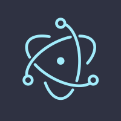
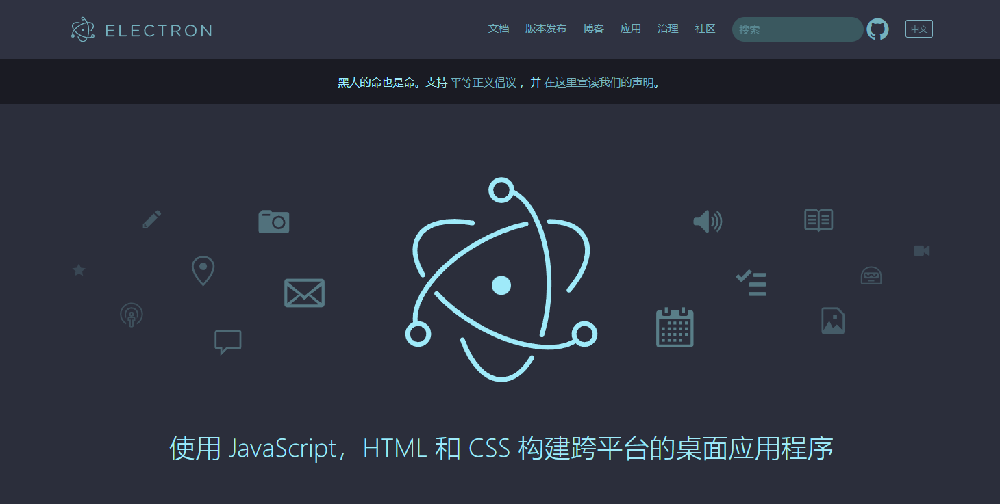
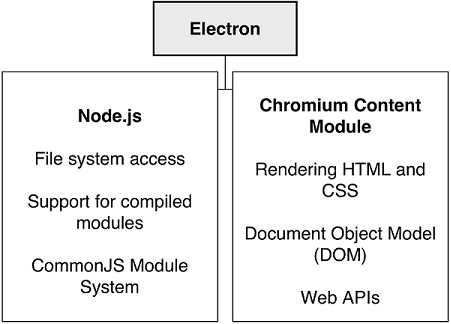

## 什么是Electron

> https://github.com/electron/electron

> https://www.electronjs.org

> Electron(最初名为Atom Shell)是GitHub开发的一个开源框架。它允许使用Node.js（作为后端）和Chromium（作为前端）完成桌面GUI应用程序的开发。Electron现已被多个开源Web应用程序用于前端与后端的开发，著名项目包括GitHub的Atom和微软的Visual Studio Code。

Electron可以用于构建具有HTML、CSS、JavaScript的跨平台桌面应用程序，它通过将Chromium和Node.js合同一个运行的环境中来实现这一点，应用程序可以打包到Mac、Windows和Linux系统上。

Electron结合了Chromium Content Module和Node.js运行时。它允许开发人员使用网页构建图形用户界面（GUI），以及通过与操作系统无关的API访问OS X，Windows和Linux上的本机操作系统功能。

Chromium和Node本身都是广受欢迎的应用程序平台，并且都已被独立用于创建雄心勃勃的应用程序。Electron将这两个平台结合在一起，允许您使用JavaScript来构建一类全新的应用程序。

> 你可以在浏览器中做的任何事情，你都可以用Electron做。任何你可以用Node做的事情，你可以用Electron做的任何事情。

我们可以一起构建利用这两个平台的应用程序，并构建仅一个平台无法实现的应用程序。

## 相关文档

* [乘风破浪，遇见跨平台桌面开发平台Electron - 使用JavaScript、HTML和CSS构建，比你想象的更简单](https://www.cnblogs.com/taylorshi/p/15609602.html)

## 相关截图
